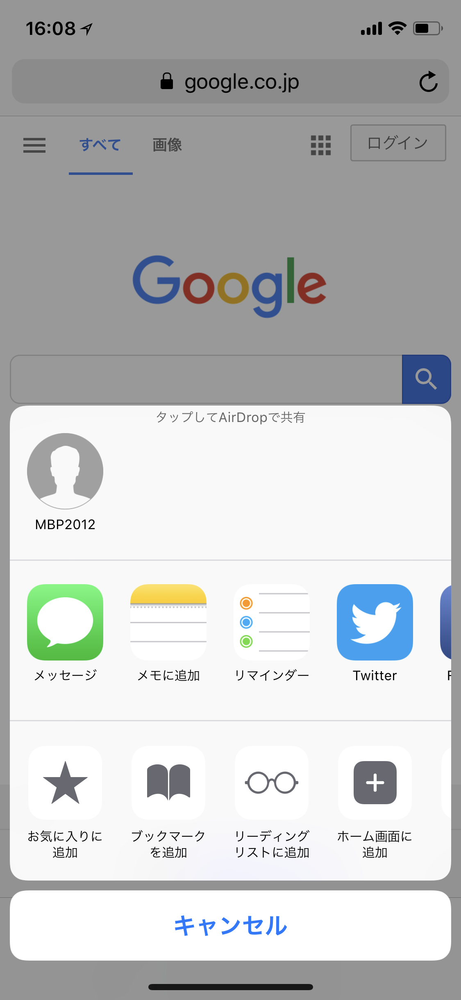
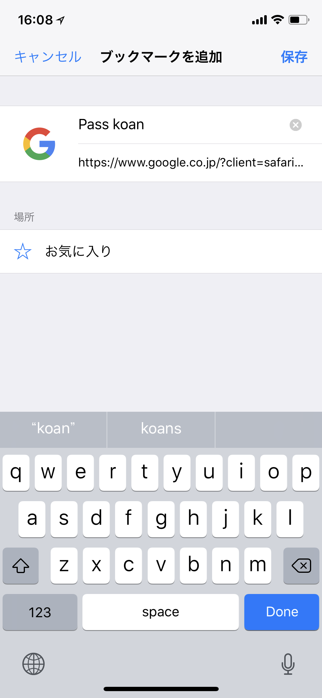
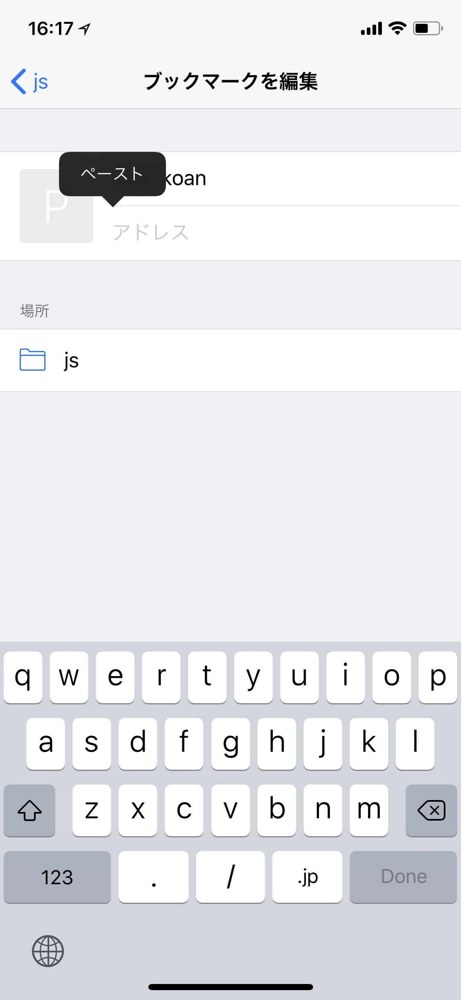
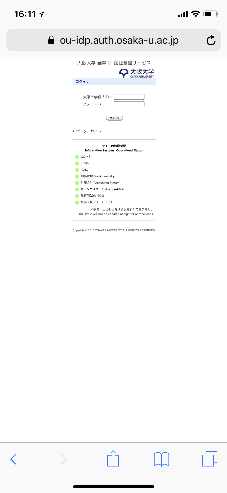
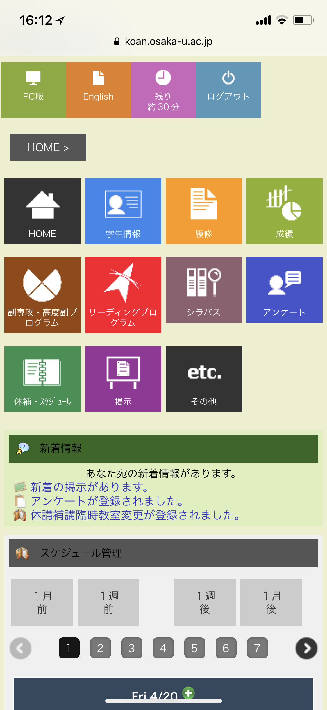

# pass-koan
大阪大学のkoanを半自動でログインするブックマークレットです<br>
(一様、自己責任でお願いします)<br>
(あと、iPhoneのsafariでしか試してないですm(_ _)m)<br>
<br>
<br>

### やり方
## pass_koan.jsのコードをコピー
ます下のjavascriptから始まるコードを全部コピーしましょう。<br>

```pass_koan.js
javascript:!function () { var e, m; function t(e, m) { e.value = m } e = "Your id", m = "Your password", t(document.getElementsByName("USER_ID")[0], e), t(document.getElementsByName("USER_PASSWORD")[0], m), document.getElementsByName("cmdForm.Submit")[0].click() }();
```
<br>
<br>
<br>

## 'Your id'と'Your password'を自分のものにする

さっきコピーしたコードの最初のあたりにYour idとYour passwordがあるので、

自分のidとパスワードに入れ替えましょう。(入れ替えても、idやpasswordは外部に公開されたりなどはないのでご安心を)

(一度メモ帳などにコピーしてから、入れ替えたほうが簡単)

(ただ自分のidとpasswordをテキスト化してることになるので、他の人に入れ替え後のコードは見せないようにしましょう)

```
{ e.value = m } e = "Your id", m = "Your password",
```
<br>
<br>
<br>

## どこかのサイトをブックマークに登録する

safariを開いて、どこでもいいのでブックマークします(今回はhttps://www.google.com/)

名前はPass koanにしました(なんでも好きな名前でいいです)

</img>
</img>
<br>
<br>
<br>

## さっきブックマークしたもののurlを変える
もう一度safariを開いて、ブックマークメニューを開きます(本のマーク)

そして、右下の「編集」をクリックして、先ブックマークしたもののurlを編集します

すでに入ってるurlを消して、

このurlをさっき自分のidとpasswordに入れ替え後のコードをコピペしましょう

</img>
<br>
<br>
<br>

## 完成
これで、自動ログインの準備は完成しました

一度koanを開いて、ブックマークメニューをクリックして、さっきのブックマークをクリックします

すると、ログインフォームに自分でidとpasswordを入れなくてもログインできていると思います


</img>
</img>

